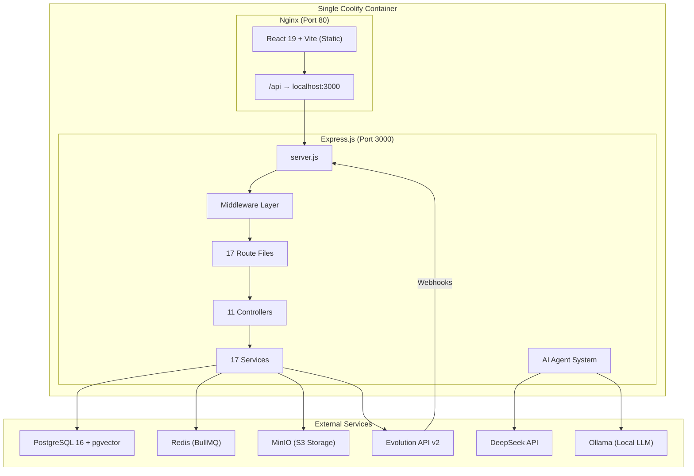
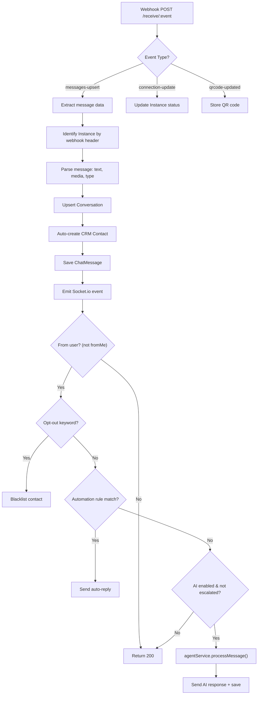
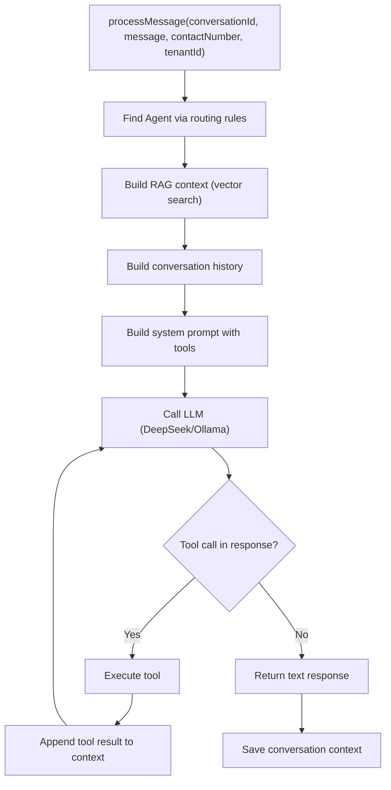
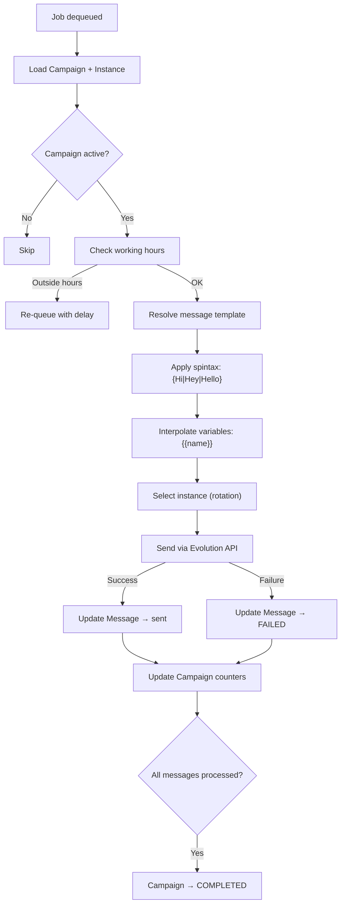
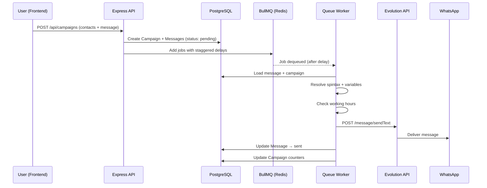
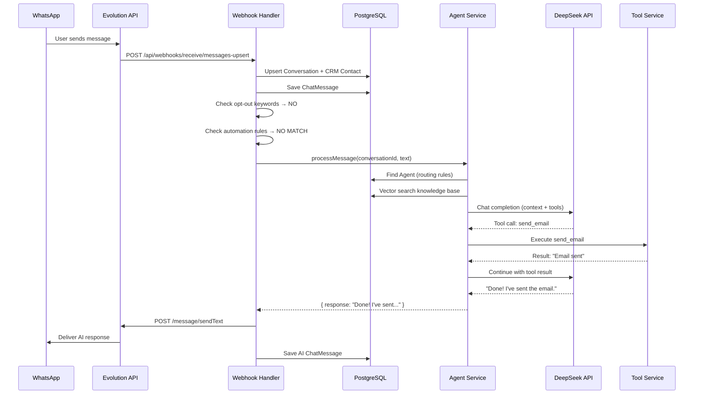
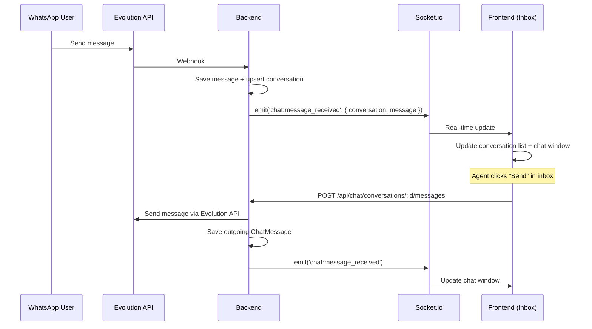

# Value chat — Exhaustive Codebase Documentation

> Enterprise WhatsApp Marketing, AI Agents & Automation Platform

---

## Table of Contents

1. [Architecture Overview](#architecture-overview)
2. [Database Schema (30+ Models)](#database-schema)
3. [Backend — Directory Structure](#backend-directory-structure)
4. [Backend — Entry Point & Middleware](#backend-entry-point--middleware)
5. [Backend — Routes Catalog](#backend-routes-catalog)
6. [Backend — Controllers (Deep Dive)](#backend-controllers)
7. [Backend — Services (Deep Dive)](#backend-services)
8. [Backend — AI Agent System](#ai-agent-system)
9. [Backend — Queue System (BullMQ)](#queue-system-bullmq)
10. [Frontend — Directory Structure](#frontend-directory-structure)
11. [Frontend — Pages Catalog](#frontend-pages-catalog)
12. [Frontend — Components](#frontend-components)
13. [Infrastructure & Deployment](#infrastructure--deployment)
14. [Data Flows](#data-flows)

---

## Architecture Overview



### Key Architecture Decisions

| Decision | Detail |
|---|---|
| **Multi-tenant** | Every DB query scoped to `tenantId` via JWT middleware |
| **Single container** | Frontend (Nginx) + Backend (Express) in one Coolify service |
| **HTTP only** | No HTTPS — `*.sslip.io` domains, `crypto.randomUUID` polyfilled in `index.html` |
| **Webhook routes public** | No auth on `/api/webhooks/*` — Evolution API sends events here |
| **Campaign messages queued** | Never sent directly; always via BullMQ (`queueService.js`) |
| **File uploads** | Multer middleware → MinIO via `storageService.js` |

---

## Database Schema

The Prisma schema contains **30+ models**. Below is every model with its purpose, key fields, and relationships.

### Core Multi-Tenancy

#### `Tenant`
The root entity. Every business using the platform is a Tenant.

| Field | Type | Purpose |
|---|---|---|
| `id` | UUID | Primary key |
| `name` | String | Business name |
| `slug` | String (unique) | URL-safe identifier |
| `planId` | FK → Plan | Subscription plan |
| `status` | String | `active` / `suspended` / `trial` |
| `onboardingStep` | Int | Current onboarding progress |
| `optoutEnabled` | Boolean | Enable/disable opt-out system |
| `optoutMessage` | String | Message sent on opt-out |
| `optoutKeywords` | String[] | Keywords that trigger opt-out |
| `systemPrompt` | Text | Default AI system prompt |
| **Relations** | | Users, Instances, Campaigns, Agents, Contacts, etc. |

#### `User`
Platform users. Each belongs to exactly one Tenant.

| Field | Type | Purpose |
|---|---|---|
| `id` | UUID | Primary key |
| `tenantId` | FK → Tenant | Tenant scope |
| `email` | String (unique) | Login credential |
| `password` | String | bcrypt hash |
| `name` | String | Display name |
| `role` | String | `owner` / `admin` / `agent` |
| `isAdmin` | Boolean | Super-admin flag (platform-level) |

#### `Plan`
Subscription plans defining feature limits.

| Field | Type | Purpose |
|---|---|---|
| `name` | String | Plan display name |
| `maxInstances` | Int | WhatsApp connections allowed |
| `maxCampaigns` | Int | Campaigns per month |
| `maxContacts` | Int | CRM contacts limit |
| `maxAgents` | Int | AI agents limit |
| `maxKnowledgeSources` | Int | KB sources per agent |
| `features` | Json | Feature flags |
| `price` | Decimal | Monthly price |

---

### WhatsApp Instances

#### `Instance`
A connected WhatsApp number/device.

| Field | Type | Purpose |
|---|---|---|
| `id` | UUID | Primary key |
| `tenantId` | FK → Tenant | Owner |
| `instanceName` | String (unique) | Evolution API instance name |
| `phoneNumber` | String? | Connected phone number |
| `displayName` | String? | Account display name |
| `profilePicUrl` | String? | WhatsApp profile picture |
| `status` | String | `open` (connected) / `close` / `connecting` |
| `qrCode` | Text? | Current QR code (base64) |
| `webhookUrl` | String? | Configured webhook endpoint |
| **Relations** | | Campaigns, Messages, AutomationRules, Conversations, AgentInstances |

---

### Campaign System

#### `Campaign`
Bulk messaging campaigns.

| Field | Type | Purpose |
|---|---|---|
| `id` | UUID | Primary key |
| `tenantId` | FK → Tenant | Owner |
| `name` | String | Campaign name |
| `messageTemplate` | Text | Primary message text |
| `mediaUrl` | String? | Attached media URL (MinIO) |
| `mediaType` | String? | `image` / `video` / `document` |
| `status` | String | `DRAFT` / `PENDING` / `SCHEDULED` / `PROCESSING` / `COMPLETED` / `PAUSED` / `FAILED` / `CANCELLED` |
| `totalContacts` | Int | Total recipients |
| `sentCount` | Int | Successfully sent |
| `failedCount` | Int | Failed deliveries |
| `scheduledAt` | DateTime? | Scheduled send time |
| `completedAt` | DateTime? | Completion timestamp |
| `segmentId` | FK → SavedSegment? | Target segment |
| `workingHoursStart` | String? | e.g. "09:00" |
| `workingHoursEnd` | String? | e.g. "18:00" |
| `workingTimezone` | String? | IANA timezone |
| **Relations** | | Messages, MessageTemplates, CampaignInstances |

#### `CampaignInstance`
Many-to-many: which WhatsApp instances a campaign uses (for rotation).

| Field | Type | Purpose |
|---|---|---|
| `campaignId` | FK → Campaign | |
| `instanceId` | FK → Instance | |
| `instanceName` | String | Denormalized for queue |

#### `MessageTemplate`
Multiple message variations per campaign (for anti-ban rotation).

| Field | Type | Purpose |
|---|---|---|
| `campaignId` | FK → Campaign | |
| `content` | Text | Template text with `{{variable}}` placeholders |
| `orderIndex` | Int | Rotation order |

#### `Message`
Individual outbound messages (one per contact per campaign).

| Field | Type | Purpose |
|---|---|---|
| `id` | UUID | Primary key |
| `campaignId` | FK → Campaign | Parent campaign |
| `instanceId` | FK → Instance | Sending instance |
| `tenantId` | FK → Tenant | Tenant scope |
| `recipientNumber` | String | WhatsApp number |
| `messageText` | Text | Resolved message (variables filled) |
| `status` | String | `pending` / `sent` / `delivered` / `read` / `FAILED` / `CANCELLED` |
| `failReason` | String? | Error details |
| `sentAt` | DateTime? | Send timestamp |
| `variables` | Json? | Contact variables for template |

---

### Chat / Inbox System

#### `Conversation`
A chat thread between the business and a contact.

| Field | Type | Purpose |
|---|---|---|
| `id` | UUID | Primary key |
| `tenantId` | FK → Tenant | |
| `contactNumber` | String | WhatsApp JID or phone |
| `contactName` | String? | Display name (pushName or group name) |
| `lastMessage` | Text? | Preview text |
| `lastMessageAt` | DateTime? | For sorting |
| `unreadCount` | Int | Unread messages |
| `status` | String | `open` / `closed` |
| `channel` | String | `whatsapp` / `meta` / `internal` |
| `assignedTo` | FK → User? | Assigned agent |
| `aiEnabled` | Boolean | AI agent active for this chat |
| `escalated` | Boolean | Escalated to human |
| `contactId` | FK → Contact? | Linked CRM contact |
| `lifecycleStageId` | FK → LifecycleStage? | Current pipeline stage |
| **Relations** | | ChatMessages, Instance |

#### `ChatMessage`
Individual messages within a conversation.

| Field | Type | Purpose |
|---|---|---|
| `id` | UUID | Primary key |
| `conversationId` | FK → Conversation | |
| `direction` | String | `incoming` / `outgoing` |
| `senderNumber` | String | |
| `recipientNumber` | String | |
| `messageType` | String | `text` / `image` / `video` / `audio` / `document` / `sticker` / `location` / `reaction` |
| `content` | Text? | Message text |
| `mediaUrl` | Text? | Media URL |
| `wamid` | String (unique) | WhatsApp message ID (dedup key) |
| `status` | String | `sent` / `delivered` / `read` / `failed` |

---

### AI Agent System

#### `Agent`
An AI agent that handles conversations.

| Field | Type | Purpose |
|---|---|---|
| `id` | UUID | Primary key |
| `tenantId` | FK → Tenant | |
| `name` | String | Agent display name |
| `systemPrompt` | Text | Agent personality / instructions |
| `model` | String | `deepseek-chat` / `deepseek-reasoner` / `ollama:*` |
| `temperature` | Float | LLM temperature |
| `maxTokens` | Int | Max response tokens |
| `isActive` | Boolean | Enable/disable |
| `routingRules` | Json? | Keyword→Agent routing config |
| `toolsEnabled` | Boolean | Allow tool calls |
| **Relations** | | AgentInstances, KnowledgeSources, AgentActions, AgentConversationContexts |

#### `AgentInstance`
Links agents to WhatsApp instances.

| Field | Type | Purpose |
|---|---|---|
| `agentId` | FK → Agent | |
| `instanceId` | FK → Instance | |

#### `KnowledgeSource`
RAG knowledge base entries for agents.

| Field | Type | Purpose |
|---|---|---|
| `id` | UUID | Primary key |
| `agentId` | FK → Agent | |
| `tenantId` | FK → Tenant | |
| `type` | String | `text` / `faq` / `file` / `url` |
| `title` | String | Document title |
| `content` | Text | Full text content |
| `embedding` | Vector(1536)? | pgvector embedding (via `Unsupported("vector(1536)")`) |
| `fileUrl` | String? | Storage URL for file sources |
| `metadata` | Json? | Source metadata |

#### `AgentAction`
Tools/actions an agent can perform.

| Field | Type | Purpose |
|---|---|---|
| `id` | UUID | Primary key |
| `agentId` | FK → Agent | |
| `tenantId` | FK → Tenant | |
| `type` | String | See [Agent Action Types](#agent-action-types) |
| `name` | String | Action display name |
| `config` | Json | Type-specific configuration |
| `isActive` | Boolean | |
| `integrationId` | FK → Integration? | For external integrations |

#### `AgentConversationContext`
Per-conversation memory for AI agents.

| Field | Type | Purpose |
|---|---|---|
| `agentId` | FK → Agent | |
| `conversationId` | FK → Conversation | |
| `context` | Text | Conversation summary |
| `messageCount` | Int | Messages in context |

---

### CRM System

#### `Contact`
CRM contact records.

| Field | Type | Purpose |
|---|---|---|
| `id` | UUID | Primary key |
| `tenantId` | FK → Tenant | |
| `phoneNumber` | String | Primary identifier |
| `name` | String? | Display name |
| `email` | String? | Email address |
| `company` | String? | Company name |
| `jobTitle` | String? | Position |
| `source` | String? | `whatsapp` / `import` / `form` / `api` |
| `tags` | String[] | Freeform tags |
| `customFields` | Json? | Dynamic field data |
| `blacklisted` | Boolean | Opted out |
| `blacklistedAt` | DateTime? | Opt-out timestamp |
| `lifecycleStageId` | FK → LifecycleStage? | Current stage |
| **Relations** | | Conversations, Labels, Notes, ActivityLogs |

#### `ContactLabel` / `ContactLabelAssignment`
Tagging system with colors, many-to-many with contacts.

#### `ContactNote`
Notes attached to contacts by users.

#### `ContactField`
Legacy custom fields per contact (by phone number).

#### `ContactFieldDefinition`
Structured custom field definitions per tenant (respond.io-style).

| Field | Type | Purpose |
|---|---|---|
| `key` | String | Programmatic key: `birthday`, `company` |
| `fieldType` | String | `text` / `number` / `date` / `dropdown` / `url` / `email` / `phone` |
| `options` | String[] | For dropdown fields |
| `visibility` | String | `always_show` / `hide_when_empty` |

---

### Automation

#### `AutomationRule`
Keyword-triggered auto-responders per instance.

| Field | Type | Purpose |
|---|---|---|
| `instanceId` | FK → Instance | |
| `tenantId` | FK → Tenant | |
| `name` | String | Rule name |
| `triggerType` | String | `keyword` / `any_message` / `welcome` |
| `triggerValue` | String? | Keyword to match |
| `responseText` | Text | Auto-reply message |
| `isActive` | Boolean | |

#### `LifecycleStage`
CRM pipeline stages (Lead → Qualified → Customer, etc.).

#### `LifecycleRule`
Automatic stage transitions based on triggers.

| Field | Type | Purpose |
|---|---|---|
| `triggerType` | String | `tag_added` / `tag_removed` / `field_updated` / `conversation_closed` |
| `triggerValue` | String | The tag name, field key, etc. |
| `targetStageId` | FK → LifecycleStage | Stage to move to |

---

### Workflows

#### `Workflow`
Multi-step automated workflows.

| Field | Type | Purpose |
|---|---|---|
| `triggerType` | String | `agent_action` / `manual` / `webhook` |
| `steps` | Text (JSON) | Array of steps: `[{ action: "sheets.append", params: {...} }]` |

#### `WorkflowExecution` / `WorkflowLog`
Execution history with per-step logging.

---

### Other Models

| Model | Purpose |
|---|---|
| `Snippet` | Pre-written response templates (e.g. `/thanks`, `/greeting`) |
| `SavedSegment` | Dynamic contact filters with AND/OR rules for campaign targeting |
| `Integration` | External service configs (Google Sheets, SMTP, webhook) with encrypted credentials |
| `ActivityLog` | Unified activity timeline for CRM + chat (lifecycle changes, labels, notes, tool calls) |

---

## Backend — Directory Structure

```
backend/src/
├── server.js                       # Express entry point (130 lines)
├── agents/
│   ├── agent.routes.js             # Agent CRUD + assignment routes
│   ├── agent.service.js            # AI agent processing (~650 lines)
│   ├── knowledge.routes.js         # Knowledge base CRUD routes
│   └── templates/
│       └── index.js                # Agent prompt templates
├── ai/
│   └── deepseek.service.js         # DeepSeek API wrapper
├── config/
│   ├── database.js                 # Prisma client singleton
│   └── redis.js                    # Redis/BullMQ connection
├── controllers/
│   ├── adminController.js          # Super-admin operations
│   ├── automationController.js     # Automation rules CRUD
│   ├── campaignController.js       # Campaign lifecycle (639 lines)
│   ├── chatController.js           # Chat/inbox operations
│   ├── contactController.js        # CRM contact management
│   ├── dashboardController.js      # Dashboard statistics
│   ├── metaWebhookController.js    # Meta/Facebook webhook handling
│   ├── segmentController.js        # Saved segments CRUD
│   ├── templateController.js       # Message template management
│   └── webhookController.js        # Evolution API webhook handler
├── middleware/
│   ├── tenantContext.js            # JWT auth + tenant isolation
│   ├── isAdmin.js                  # Super-admin gate
│   ├── upload.js                   # Multer file upload config
│   └── verifyWebhookContext.js     # Webhook instance verification
├── routes/
│   ├── admin.js                    # /api/admin/*
│   ├── auth.js                     # /api/auth/*
│   ├── automations.js              # /api/automations/*
│   ├── campaigns.js                # /api/campaigns/*
│   ├── chat.js                     # /api/chat/*
│   ├── contactFields.routes.js     # /api/contact-fields/*
│   ├── contacts.js                 # /api/contacts/*
│   ├── dashboard.js                # /api/dashboard/*
│   ├── instances.js                # /api/instances/*
│   ├── integrations.js             # /api/integrations/*
│   ├── lifecycle.routes.js         # /api/lifecycle/*
│   ├── lifecycleRules.routes.js    # /api/lifecycle-rules/*
│   ├── onboarding.js               # /api/onboarding/*
│   ├── segments.js                 # /api/segments/*
│   ├── settings.js                 # /api/settings/*
│   ├── snippets.routes.js          # /api/snippets/*
│   ├── tags.routes.js              # /api/tags/*
│   ├── team.js                     # /api/team/*
│   ├── templates.js                # /api/templates/*
│   └── webhooks.js                 # /api/webhooks/* (PUBLIC)
├── services/
│   ├── aiService.js                # General AI utility service
│   ├── calendarService.js          # Google Calendar integration
│   ├── chat.service.js             # Chat operations (~350 lines)
│   ├── crmService.js               # CRM operations
│   ├── csvService.js               # CSV import/export
│   ├── emailService.js             # Email sending (SMTP/SendGrid)
│   ├── embeddingService.js         # Text → Vector embeddings
│   ├── evolutionApi.js             # Evolution API client (14 methods)
│   ├── googleSheetService.js       # Google Sheets integration
│   ├── integration.service.js      # Integration management
│   ├── knowledgeService.js         # Knowledge base operations
│   ├── metaApi.js                  # Meta/Facebook API client
│   ├── queueService.js             # BullMQ queue (~250 lines)
│   ├── schedulerService.js         # Cron/scheduled tasks
│   ├── socketService.js            # Socket.io real-time events
│   ├── storageService.js           # MinIO file storage
│   ├── toolService.js              # Agent tool execution
│   └── workflow.service.js         # Workflow execution engine
├── queue/
│   └── (BullMQ worker configs)
├── models/
│   └── (additional model helpers)
└── utils/
    └── encryption.js               # Credential encryption
```

---

## Backend — Entry Point & Middleware

### [server.js](file:///d:/projects/valuewatsv1/valuewats/backend/src/server.js) (130 lines)

The Express entry point configures:

1. **Security**: Helmet with `crossOriginResourcePolicy: false`
2. **CORS**: Open for `*` origin
3. **Body parsing**: JSON (50MB limit), URL-encoded (50MB limit)
4. **Static files**: `/uploads` served from disk
5. **Route mounting**: 21 route groups
6. **Socket.io**: Initialized on same HTTP server
7. **Queue**: BullMQ worker started
8. **Scheduler**: Cron jobs initialized (scheduled campaigns)

**Route Mount Order:**
```
/api/auth              → auth.js
/api/instances         → instances.js
/api/campaigns         → campaigns.js
/api/dashboard         → dashboard.js
/api/webhooks          → webhooks.js (PUBLIC — no tenantContext)
/api/contacts          → contacts.js
/api/chat              → chat.js
/api/automations       → automations.js
/api/team              → team.js
/api/settings          → settings.js
/api/admin             → admin.js
/api/agents            → agent.routes.js
/api/knowledge         → knowledge.routes.js
/api/onboarding        → onboarding.js
/api/integrations      → integrations.js
/api/templates         → templates.js
/api/lifecycle         → lifecycle.routes.js
/api/lifecycle-rules   → lifecycleRules.routes.js
/api/contact-fields    → contactFields.routes.js
/api/snippets          → snippets.routes.js
/api/tags              → tags.routes.js
/api/segments          → segments.js
```

### [tenantContext.js](file:///d:/projects/valuewatsv1/valuewats/backend/src/middleware/tenantContext.js) — JWT Auth + Tenant Isolation

Every protected route uses this middleware:

1. Extracts `Bearer <token>` from `Authorization` header
2. Verifies JWT with `JWT_SECRET`
3. Queries the User record (including Tenant with Plan)
4. **Checks tenant status** — if `suspended`, returns 403
5. Attaches `req.user` = `{ id, tenantId, role, tenant: { ...planLimits } }`

### [isAdmin.js](file:///d:/projects/valuewatsv1/valuewats/backend/src/middleware/isAdmin.js)

Checks `req.user.isAdmin === true` for super-admin routes.

### [upload.js](file:///d:/projects/valuewatsv1/valuewats/backend/src/middleware/upload.js)

Multer configured with memory storage for file uploads.

### [verifyWebhookContext.js](file:///d:/projects/valuewatsv1/valuewats/backend/src/middleware/verifyWebhookContext.js)

Identifies which Instance a webhook belongs to via `X-Instance-Name` header or URL path parameter.

---

## Backend — Routes Catalog

### Authentication (`/api/auth`)
| Method | Path | Purpose |
|---|---|---|
| POST | `/register` | Create tenant + first user |
| POST | `/login` | Login → JWT token |
| GET | `/me` | Get current user profile |

### Instances (`/api/instances`)
| Method | Path | Purpose |
|---|---|---|
| GET | `/` | List all instances for tenant |
| POST | `/` | Create new WhatsApp instance |
| GET | `/:id` | Get instance details |
| DELETE | `/:id` | Delete instance |
| POST | `/:id/qr` | Fetch QR code |
| PATCH | `/:id/status` | Update instance status |

### Campaigns (`/api/campaigns`)
| Method | Path | Purpose |
|---|---|---|
| GET | `/` | List campaigns (paginated) |
| POST | `/` | Create campaign (CSV/sheet/manual contacts) |
| GET | `/active` | Get active/processing campaigns |
| GET | `/:id` | Campaign details with stats |
| PUT | `/:id` | Update campaign (edit + resume) |
| POST | `/:id/pause` | Pause campaign |
| POST | `/:id/resume` | Resume campaign |
| POST | `/:id/stop` | Stop/cancel campaign |
| DELETE | `/:id` | Delete campaign + messages |
| GET | `/:id/messages` | Campaign message log |
| GET | `/:id/export` | Export contacts as CSV |
| POST | `/preview-sheet` | Preview Google Sheet columns |

### Chat / Inbox (`/api/chat`)
| Method | Path | Purpose |
|---|---|---|
| GET | `/conversations` | List conversations (filtered) |
| GET | `/conversations/:id/messages` | Get conversation messages |
| POST | `/conversations/:id/messages` | Send message from inbox |
| PATCH | `/conversations/:id/read` | Mark as read |
| PATCH | `/conversations/:id/assign` | Assign to agent |
| PATCH | `/conversations/:id/status` | Open/close conversation |
| PATCH | `/conversations/:id/ai` | Toggle AI agent |

### Contacts / CRM (`/api/contacts`)
| Method | Path | Purpose |
|---|---|---|
| GET | `/` | List contacts (search, filter, paginate) |
| POST | `/` | Create contact |
| GET | `/:id` | Contact profile with timeline |
| PUT | `/:id` | Update contact |
| DELETE | `/:id` | Delete contact |
| POST | `/import` | Bulk import (CSV) |
| POST | `/:id/tags` | Add tags |
| DELETE | `/:id/tags` | Remove tags |
| POST | `/:id/notes` | Add note |

### AI Agents (`/api/agents`)
| Method | Path | Purpose |
|---|---|---|
| GET | `/` | List agents |
| POST | `/` | Create agent |
| GET | `/:id` | Agent details |
| PUT | `/:id` | Update agent |
| DELETE | `/:id` | Delete agent |
| POST | `/:id/assign` | Assign to instances |
| POST | `/:id/actions` | Add agent action/tool |
| PUT | `/:id/actions/:actionId` | Update action |
| DELETE | `/:id/actions/:actionId` | Remove action |

### Knowledge Base (`/api/knowledge`)
| Method | Path | Purpose |
|---|---|---|
| GET | `/:agentId/sources` | List knowledge sources |
| POST | `/:agentId/sources` | Add knowledge source (text/file/URL) |
| PUT | `/:agentId/sources/:id` | Update source |
| DELETE | `/:agentId/sources/:id` | Delete source |

### Webhooks (`/api/webhooks`) — **PUBLIC, NO AUTH**
| Method | Path | Purpose |
|---|---|---|
| POST | `/receive/:event` | Evolution API webhook (parameterized) |
| POST | `/meta/:event` | Meta/Facebook webhook |

### Other Protected Routes

| Route Group | Purpose |
|---|---|
| `/api/automations` | CRUD for AutomationRules |
| `/api/dashboard` | Statistics (message counts, campaign stats, conversation metrics) |
| `/api/team` | Team member management (invite, remove, update roles) |
| `/api/settings` | Tenant settings, opt-out config, system prompt |
| `/api/admin` | Super-admin: list tenants, manage plans, view logs |
| `/api/onboarding` | Onboarding wizard progress tracking |
| `/api/integrations` | CRUD for Integrations (Google Sheets, SMTP, etc.) |
| `/api/templates` | Message template management |
| `/api/lifecycle` | Lifecycle stage CRUD |
| `/api/lifecycle-rules` | Lifecycle transition rule CRUD |
| `/api/contact-fields` | Contact field definition CRUD |
| `/api/snippets` | Response snippet CRUD |
| `/api/tags` | Tag management |
| `/api/segments` | Saved segment CRUD with dynamic filters |

---

## Backend — Controllers

### [campaignController.js](file:///d:/projects/valuewatsv1/valuewats/backend/src/controllers/campaignController.js) (639 lines)

The most complex controller. Handles the full campaign lifecycle:

**`createCampaign`**:
1. Validates required fields (name, message, contacts source)
2. Handles 3 contact sources:
   - **CSV upload** → parse via `csvService`
   - **Google Sheet URL** → fetch via `googleSheetService`
   - **Manual list** → direct array
3. Supports **multi-instance campaigns** — round-robins across multiple WhatsApp numbers
4. Creates `Campaign`, `MessageTemplate` (multiple variations), `CampaignInstance`, and `Message` records
5. For each contact: creates a `Message` record with resolved variables (`{{name}}`, `{{phone}}`, etc.)
6. If `scheduledAt` is set → campaign stays `SCHEDULED` (scheduler picks it up)
7. Otherwise → immediately queues all messages via BullMQ with staggered delays

**`resumeCampaign`**: Re-queues all `pending` messages with fresh staggered delays.

**`pauseCampaign`**: Removes all delayed/waiting BullMQ jobs for the campaign. Status → `PAUSED`.

**`stopCampaign`**: Removes jobs + marks all pending messages as `FAILED`. Status → `FAILED`.

**`updateCampaign`**: Allows editing message templates and replacing contact list when campaign is `PAUSED`/`PENDING`/`SCHEDULED`.

**`exportCampaignContacts`**: CSV export of campaign messages with status, fail reason, and timestamp.

### [webhookController.js](file:///d:/projects/valuewatsv1/valuewats/backend/src/controllers/webhookController.js) (~400 lines)

Handles incoming Evolution API webhooks. Processing pipeline:



Key behaviors:
- **Contact auto-creation**: Every incoming message from a new number creates a `Contact` record
- **Contact linking**: Automatically links contacts to conversations
- **Group support**: Fetches real group names from Evolution API
- **Media handling**: Downloads media via Evolution API, uploads to storage
- **Opt-out system**: Configurable keywords → blacklisting + confirmation message
- **Automation rules**: Checked in order (keyword → any_message → welcome)
- **AI fallback**: If no automation matches AND `aiEnabled=true` AND not escalated → calls agent service

### [chatController.js](file:///d:/projects/valuewatsv1/valuewats/backend/src/controllers/chatController.js)

Inbox operations:
- List conversations with search, status filtering, assignment filtering
- Send messages from inbox → delegates to `chat.service.js`
- Assign conversations to team members
- Toggle AI agent on/off per conversation
- Mark conversations as read

### [contactController.js](file:///d:/projects/valuewatsv1/valuewats/backend/src/controllers/contactController.js)

CRM operations:
- Full CRUD with search (name, phone, email, company)
- Tag management (add/remove)
- Note management
- CSV bulk import
- Lifecycle stage assignment
- Contact profile with activity timeline

### [adminController.js](file:///d:/projects/valuewatsv1/valuewats/backend/src/controllers/adminController.js)

Super-admin operations:
- List/search all tenants
- View tenant details with instance/campaign counts
- Manage subscription plans
- View system-wide logs
- Suspend/activate tenants

---

## Backend — Services

### [evolutionApi.js](file:///d:/projects/valuewatsv1/valuewats/backend/src/services/evolutionApi.js) — Evolution API Client

Singleton class wrapping all Evolution API v2 calls:

| Method | Purpose |
|---|---|
| `createInstance(instanceName, webhookUrl, tenantId)` | Create new WhatsApp instance with webhook |
| `sendPresence(instanceName, number, delayMs)` | Show "typing..." indicator |
| `sendMessage(tenantId, instanceName, number, text, mediaUrl, mediaType)` | Send text or media message (2 retries, 60s timeout) |
| `deleteInstance(instanceName)` | Delete instance |
| `logoutInstance(instanceName)` | Logout without throwing on failure |
| `fetchQrCode(instanceName)` | Get QR code for pairing |
| `fetchConversations(instanceName)` | List all conversations |
| `fetchMessages(instanceName, number, count)` | Get message history |
| `getGroupInfo(instanceName, groupJid)` | Fetch group name/subject |
| `downloadMedia(instanceName, messageKey)` | Get media as base64 |
| `setWebhook(instanceName, webhookUrl, enabled, tenantId)` | Configure webhook events |

**Retry logic**: `sendMessage` retries once after 2 seconds on failure. Timeout is 60 seconds.

**Webhook configuration**: Subscribes to `MESSAGES_UPSERT`, `MESSAGES_UPDATE`, `CONNECTION_UPDATE`, `QRCODE_UPDATED`, `SEND_MESSAGE`. Custom headers include `X-Instance-Name` and `X-Tenant-ID`.

### [chat.service.js](file:///d:/projects/valuewatsv1/valuewats/backend/src/services/chat.service.js) (~350 lines)

Core chat operations:

**`upsertConversation(tenantId, contactNumber, messageData)`**:
- Creates or updates conversation record
- Updates `lastMessage`, `lastMessageAt`, increments `unreadCount`
- Handles both individual and group chats

**`saveMessage(conversationId, data)`**:
- Creates `ChatMessage` record
- Handles deduplication via unique `wamid` constraint

**`sendMessage(conversationId, userId, content, mediaUrl, messageType)`**:
- Sends message via Evolution API
- Saves to database
- Emits socket event
- Supports text + media

**`syncConversations(instanceId, tenantId)`**:
- Fetches all conversations from Evolution API
- Creates/updates local conversation records

**`assignConversation(conversationId, userId)`**:
- Updates assignment
- Logs activity
- Emits socket event

### [socketService.js](file:///d:/projects/valuewatsv1/valuewats/backend/src/services/socketService.js)

Socket.io configuration:
- Namespace: `/chat`
- Room per tenant: `tenant:{tenantId}`
- Events: `chat:message_received`, `chat:conversation_updated`, `chat:assignment_changed`

### [storageService.js](file:///d:/projects/valuewatsv1/valuewats/backend/src/services/storageService.js)

MinIO S3-compatible storage:
- Bucket management (auto-create)
- File upload with content-type detection
- Pre-signed URL generation
- Path: `{tenantId}/{type}/{uuid}-{filename}`

### [emailService.js](file:///d:/projects/valuewatsv1/valuewats/backend/src/services/emailService.js)

SMTP email sending for agent tools (send email action).

### [calendarService.js](file:///d:/projects/valuewatsv1/valuewats/backend/src/services/calendarService.js)

Google Calendar integration for agent tools (check availability, create events).

### [googleSheetService.js](file:///d:/projects/valuewatsv1/valuewats/backend/src/services/googleSheetService.js)

Google Sheets connectivity:
- Fetch sheet headers (for column mapping)
- Fetch rows as contact data
- Append rows (for agent tool actions)

### [embeddingService.js](file:///d:/projects/valuewatsv1/valuewats/backend/src/services/embeddingService.js)

Text-to-vector embedding generation for RAG:
- Uses embedding model to generate 1536-dimension vectors
- Stores vectors in PostgreSQL via pgvector

### [knowledgeService.js](file:///d:/projects/valuewatsv1/valuewats/backend/src/services/knowledgeService.js)

Knowledge base operations:
- CRUD for knowledge sources
- Embedding generation on create/update
- Vector similarity search for RAG queries

### [crmService.js](file:///d:/projects/valuewatsv1/valuewats/backend/src/services/crmService.js)

CRM utility functions used by agent tools:
- Contact lookup by phone
- Tag operations
- Lifecycle stage updates
- Custom field updates

### [workflow.service.js](file:///d:/projects/valuewatsv1/valuewats/backend/src/services/workflow.service.js)

Workflow execution engine:
- Executes workflow steps sequentially
- Each step can be: Google Sheets append, email send, webhook call, etc.
- Logs each step execution
- Handles errors with step-level granularity

### [toolService.js](file:///d:/projects/valuewatsv1/valuewats/backend/src/services/toolService.js)

Agent tool execution dispatcher:
- Routes tool calls to the appropriate service
- Handles: email, calendar, sheets, CRM, webhook, HTTP request tools
- Returns structured results for agent context

### [schedulerService.js](file:///d:/projects/valuewatsv1/valuewats/backend/src/services/schedulerService.js)

Cron-based scheduler:
- Checks for `SCHEDULED` campaigns where `scheduledAt <= now()`
- Triggers campaign execution by queuing messages
- Runs on interval (e.g., every minute)

### [integration.service.js](file:///d:/projects/valuewatsv1/valuewats/backend/src/services/integration.service.js)

Integration management:
- CRUD for integration records
- Credential encryption/decryption
- OAuth flow support (Google)

---

## AI Agent System

### [agent.service.js](file:///d:/projects/valuewatsv1/valuewats/backend/src/agents/agent.service.js) (~650 lines)

The brain of the AI system. Processes incoming messages through a multi-step pipeline:



**Agent Routing**:
- Finds agents assigned to the conversation's instance
- If multiple agents: checks `routingRules` (keyword-based routing)
- Falls back to first active agent

**RAG Context Building**:
1. Generates embedding for the user's message
2. Performs pgvector similarity search across agent's knowledge sources
3. Returns top-N most relevant chunks as context

**Tool Call Loop**:
- LLM can request tool calls
- System executes tool and feeds result back
- Loops up to 5 iterations (prevents infinite loops)
- Each tool result is added to the conversation context

#### Agent Action Types

| Type | Description | Config Fields |
|---|---|---|
| `send_email` | Send email via SMTP | `to`, `subject`, `body` (or dynamic from LLM) |
| `google_sheets_append` | Append row to Google Sheet | `spreadsheetId`, `range`, `values` |
| `check_calendar` | Check calendar availability | `calendarId`, `date` |
| `create_event` | Create calendar event | `calendarId`, `summary`, `start`, `end` |
| `update_contact` | Update CRM contact fields | `field`, `value` |
| `assign_tag` | Add tag to contact | `tag` |
| `send_whatsapp` | Send WhatsApp to another number | `number`, `message` |
| `http_request` | Make arbitrary HTTP request | `url`, `method`, `headers`, `body` |

### [deepseek.service.js](file:///d:/projects/valuewatsv1/valuewats/backend/src/ai/deepseek.service.js)

DeepSeek API wrapper:
- Chat completions with tool definitions
- Supports `deepseek-chat` and `deepseek-reasoner` models
- Handles streaming and non-streaming modes
- Ollama fallback support (local models)

### [templates/index.js](file:///d:/projects/valuewatsv1/valuewats/backend/src/agents/templates/index.js)

System prompt templates for different agent personalities.

---

## Queue System (BullMQ)

### [queueService.js](file:///d:/projects/valuewatsv1/valuewats/backend/src/services/queueService.js) (~250 lines)

BullMQ-based campaign message queue with sophisticated anti-ban features:

**Queue: `message-queue`**

**Worker Processing Pipeline**:



**Anti-Ban Features**:

1. **Spintax**: Messages like `{Hi|Hello|Hey} {{name}}` randomly resolve to different variations
2. **Template Rotation**: Multiple message templates rotate across contacts
3. **Instance Rotation**: Multi-instance campaigns distribute messages across WhatsApp numbers
4. **Working Hours**: Messages only sent during configured business hours (timezone-aware)
5. **Staggered Delays**: Each message has a random delay (`minDelay` + random * `maxDelay`)
6. **Variable Interpolation**: `{{name}}`, `{{phone}}`, custom fields from contact data

**Job Data Shape**:
```json
{
  "campaignId": "uuid",
  "messageId": "uuid",
  "recipientNumber": "+1234567890",
  "messageText": "Resolved message",
  "instanceName": "instance-1",
  "tenantId": "uuid",
  "mediaUrl": "https://...",
  "mediaType": "image"
}
```

---

## Frontend — Directory Structure

```
frontend/src/
├── App.jsx                         # Router + layout
├── main.jsx                        # React 19 entry point
├── api/
│   └── client.js                   # Axios instance with JWT interceptor
├── components/
│   ├── ActionCard.jsx              # Reusable action card
│   ├── ActivityFeed.jsx            # Activity timeline component
│   ├── GlobalProgressBar.jsx       # Top progress bar
│   ├── HttpRequestSideSheet.jsx    # HTTP request config panel
│   ├── Layout.jsx                  # Main app layout (sidebar + content)
│   ├── RichTextarea.jsx            # Rich text input with emoji/variables
│   ├── SettingsLayout.jsx          # Settings page layout
│   ├── ValueWatsLoader.jsx         # Branded loading spinner
│   ├── admin/
│   │   ├── AdminLayout.jsx         # Admin panel layout
│   │   └── AdminRoute.jsx          # Admin route guard
│   ├── chat/
│   │   ├── ChatWindow.jsx          # Main chat message area
│   │   ├── ContactSidebar.jsx      # Contact info sidebar in chat
│   │   ├── ConversationList.jsx    # Conversation list sidebar
│   │   └── InboxFiltersSidebar.jsx # Filter sidebar (status, assignment)
│   ├── public/
│   │   ├── HelpCenterLayout.jsx    # Help center wrapper
│   │   ├── LegalLayout.jsx         # Legal pages wrapper
│   │   └── PublicLayout.jsx        # Marketing/public site wrapper
│   └── ui/
│       └── OrbitingCircles.jsx     # Decorative animated circles
├── hooks/
│   └── useAgents.js                # React hook for agent operations
└── pages/
    ├── Agents.jsx                  # AI agent management
    ├── Automations.jsx             # Automation rules
    ├── CampaignDetails.jsx         # Single campaign view with live stats
    ├── Campaigns.jsx               # Campaign list
    ├── ChannelManage.jsx           # Single channel management
    ├── Channels.jsx                # Channel list
    ├── ConnectChannel.jsx          # New channel wizard
    ├── ContactProfile.jsx          # Contact detail page
    ├── Contacts.jsx                # Contact list / CRM
    ├── Dashboard.jsx               # Main dashboard with stats
    ├── Inbox.jsx                   # Chat inbox (3-panel layout)
    ├── Integrations.jsx            # Third-party integrations
    ├── Login.jsx                   # Login page
    ├── NewCampaign.jsx             # Campaign creation wizard
    ├── Onboarding.jsx              # New user onboarding flow
    ├── Register.jsx                # Registration page
    ├── Settings.jsx                # Tenant settings
    ├── Team.jsx                    # Team member management
    ├── Templates.jsx               # Message template editor
    ├── Workflows.jsx               # Workflow builder
    ├── admin/
    │   ├── AdminDashboard.jsx      # Platform-wide stats
    │   ├── AdminLogs.jsx           # System logs viewer
    │   ├── AdminPlans.jsx          # Plan management
    │   ├── AdminTenants.jsx        # Tenant management
    │   └── AdminUsers.jsx          # User management
    └── public/
        ├── About.jsx               # About page
        ├── Contact.jsx             # Contact us page
        ├── Landing.jsx             # Marketing landing page
        ├── Pricing.jsx             # Pricing page
        ├── Roadmap.jsx             # Public roadmap
        ├── WhyUs.jsx               # Why Value chat page
        └── help/
            ├── ChannelHelp.jsx     # Channel setup guides
            ├── ChannelsList.jsx    # Channel comparison
            ├── FeatureHelp.jsx     # Feature documentation
            ├── GettingStarted.jsx  # Getting started guide
            ├── HelpCenter.jsx      # Help center home
            ├── ProductHelp.jsx     # Product documentation
            └── SettingsHelp.jsx    # Settings documentation
```

---

## Frontend — Pages Catalog

| Page | Path | Description |
|---|---|---|
| **Dashboard** | `/` | Overview stats: total contacts, messages, campaigns, active instances |
| **Inbox** | `/inbox` | 3-panel chat interface: conversation list + chat window + contact sidebar |
| **Contacts** | `/contacts` | CRM contact list with search, tags, segments, import |
| **ContactProfile** | `/contacts/:id` | Full contact profile with activity timeline, notes, labels, custom fields |
| **Campaigns** | `/campaigns` | Campaign list with status badges, sent/failed counts |
| **NewCampaign** | `/campaigns/new` | Multi-step wizard: name → contacts source → message → instances → schedule |
| **CampaignDetails** | `/campaigns/:id` | Live campaign stats, message log, controls (pause/resume/stop/edit) |
| **Channels** | `/channels` | List of WhatsApp instances with status indicators |
| **ConnectChannel** | `/channels/connect` | QR code scanner for new WhatsApp connections |
| **ChannelManage** | `/channels/:id` | Instance settings, webhook config, assigned agents |
| **Agents** | `/agents` | AI agent list with create/edit dialogs |
| **Automations** | `/automations` | Automation rule builder (keyword, any_message, welcome triggers) |
| **Integrations** | `/integrations` | Third-party service connections (Google Sheets, SMTP) |
| **Templates** | `/templates` | Message template library with variable support |
| **Workflows** | `/workflows` | Workflow builder with step editor |
| **Team** | `/team` | Team member list with role management (owner/admin/agent) |
| **Settings** | `/settings` | Tenant settings: name, opt-out config, system prompt, plan info |
| **Onboarding** | `/onboarding` | Step-by-step setup wizard for new tenants |
| **Login** | `/login` | Email/password login form |
| **Register** | `/register` | Registration with tenant creation |

### Admin Pages (Super-Admin Only)

| Page | Path | Description |
|---|---|---|
| **AdminDashboard** | `/admin` | Platform-wide metrics |
| **AdminTenants** | `/admin/tenants` | Tenant management, suspend/activate |
| **AdminUsers** | `/admin/users` | User management across tenants |
| **AdminPlans** | `/admin/plans` | Subscription plan editor |
| **AdminLogs** | `/admin/logs` | System-wide log viewer |

### Public Pages (No Auth)

| Page | Path | Description |
|---|---|---|
| **Landing** | `/landing` | Marketing homepage |
| **Pricing** | `/pricing` | Plan comparison |
| **About** | `/about` | About the platform |
| **Contact** | `/contact` | Contact form |
| **WhyUs** | `/why-us` | Competitive advantages |
| **Roadmap** | `/roadmap` | Public feature roadmap |
| **HelpCenter** | `/help` | Documentation hub |

---

## Infrastructure & Deployment

### Coolify Services

| Service | Coolify Name | Port | Purpose |
|---|---|---|---|
| **App** | `grumpy-gentoo` | 80 | Frontend (Nginx) + Backend (Express:3000) |
| **PostgreSQL** | `postgresql-database` | 5432 | Primary DB with pgvector |
| **Redis** | `redis-database` | 6379 | BullMQ queue backend |
| **Evolution API** | `evolution-api` | 8080 | WhatsApp gateway |
| **MinIO** | `minio` | 9000/9001 | S3-compatible file storage |
| **Ollama** | `ollama` | 11434 | Local LLM (optional) |

### Nginx Configuration

```
server {
    listen 80;
    client_max_body_size 50M;  # Must match Express body-parser

    # Frontend - static files
    location / {
        root /usr/share/nginx/html;
        try_files $file $uri /index.html;
    }

    # Backend API proxy
    location /api {
        proxy_pass http://localhost:3000;
        proxy_http_version 1.1;
        proxy_set_header Upgrade $http_upgrade;
        proxy_set_header Connection "upgrade";  # For WebSocket/Socket.io
    }
}
```

### Environment Variables

Key env vars managed in Coolify:
- `DATABASE_URL` — PostgreSQL connection string
- `REDIS_URL` — Redis connection string
- `JWT_SECRET` — JWT signing secret
- `EVOLUTION_API_URL` — Evolution API base URL
- `EVOLUTION_API_KEY` — Evolution API authentication
- `DEEPSEEK_API_KEY` — DeepSeek AI API key
- `MINIO_ENDPOINT`, `MINIO_ACCESS_KEY`, `MINIO_SECRET_KEY` — MinIO credentials
- `WEBHOOK_BASE_URL` — Public URL for webhook callbacks

---

## Data Flows

### 1. Campaign Execution Flow



### 2. Incoming Message → AI Response Flow



### 3. Real-Time Chat (Inbox)


